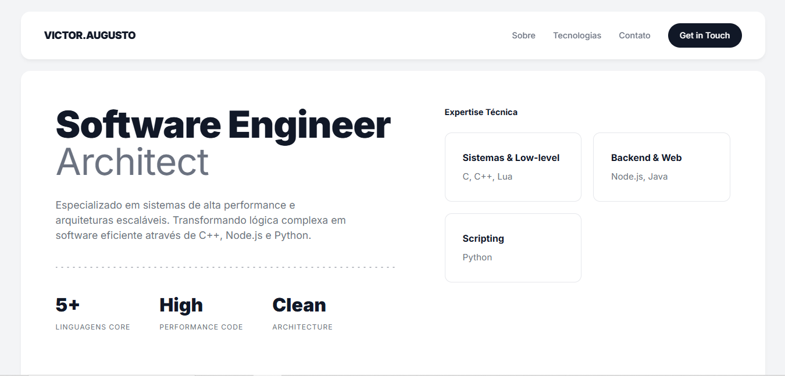

# 💼 Portfólio – Victor Augusto

Portfólio pessoal desenvolvido com **Node.js** e **Express**, utilizando **HTML, CSS e JavaScript** puros, com uma estrutura organizada e deploy realizado na **Vercel**.

🔗 **Site online:**  
[](https://my-portifolio-89uo1hfeu-vit-ops-projects.vercel.app/)


---

## 🚀 Tecnologias utilizadas
- Node.js
- Express
- HTML5
- CSS3
- JavaScript
- Vercel
- Git & GitHub

---

## 📁 Estrutura do projeto

```text
Portifolio
├─ api
│  └─ index.js
├─ src
│  ├─ app.js
│  └─ routes
│     └─ Pages.js
├─ public
│  ├─ html
│  │  └─ home.html
│  ├─ css
│  │  └─ home.css
│  ├─ js
│  │  └─ home.js
│  └─ images
│     ├─ Perfil.png
│     └─ favicon.svg
├─ server.js
├─ vercel.json
├─ package.json
└─ .gitignore
